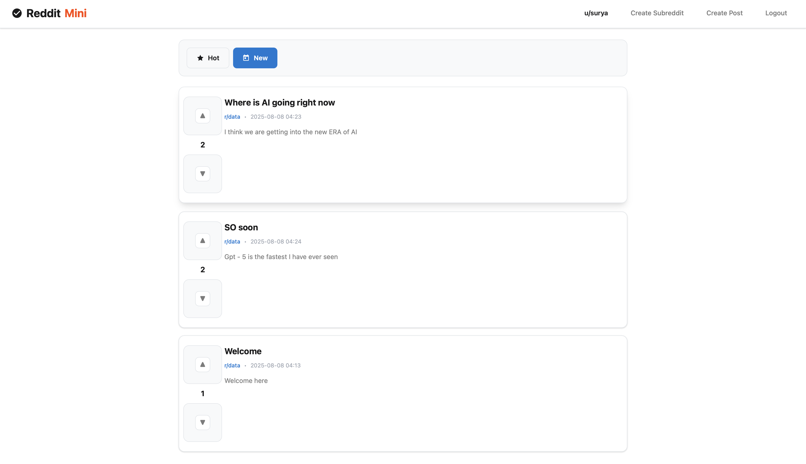

# Reddit Clone MVP (Flask)
A tiny Reddit-style app with users, subreddits, posts, comments, and voting.

## Screenshots

### Home Page

*Modern, clean home page with posts, voting system, and navigation*

### Login Page

*User-friendly login interface with modern styling*

## Quickstart
```bash
python -m venv .venv
source .venv/bin/activate  # Windows: .venv\Scripts\activate
pip install -r requirements.txt
flask --app app.py init-db
flask --app app.py run
```

Visit http://127.0.0.1:5000

## Features
- **Modern UI/UX** - Clean, professional design with smooth animations
- **User Authentication** - Register, login, logout with secure password hashing
- **Subreddits** - Create and browse communities (`r/<name>`)
- **Posts & Comments** - Create posts with titles and content, comment on posts
- **Voting System** - Upvote/downvote posts and comments (toggle/change)
- **Sorting** - Sort by **Hot** (score) or **New** (date)
- **Responsive Design** - Works great on desktop and mobile devices

## Tech Stack
- **Backend**: Flask (Python)
- **Database**: SQLite with SQLAlchemy ORM
- **Authentication**: Flask-Login
- **Forms**: Flask-WTF
- **Frontend**: HTML5, CSS3, Modern JavaScript
- **Styling**: Custom CSS with modern design system

## Notes
- SQLite DB lives at `reddit.db` (see `config.py`).
- Change `SECRET_KEY` and `DATABASE_URL` via env vars in prod.
- Modern, professional UI with clean typography and smooth interactions.
